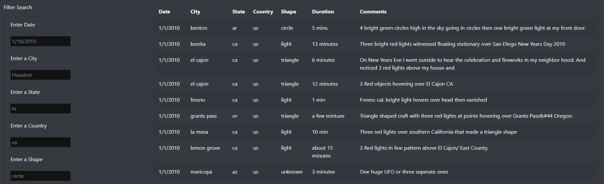

# Mission to Mars

## Project Purpose
The purpose of this project is learn the basics of JavaScript by creating a simple, dynamic website, that compiles data from many different UFO sightings from around the US. The UFO data populating the webpage can be filtered by a variety of parameters specified by the user, such as by the city, date, or shape of the sighting.

## Resources
- Software: 
	- JavaScript ES6+
	- D3 (Data-Driven Documents)
	- HTML/CSS
	- Bootstrap
	
## The HTML page:

Using the Bootstrap grid system, I was able to organize the webpage's content into neat rows and columns. The navigation bar and the large title at the top stretch across the entire width of the page, while the short paragraph below is separated into two different columns.

The lower portion of the webpage contains the UFO data neatly held within a table, and a section on the left that allows for user inputted filters. The user can choose to filter by date, city, state, country, or shape by simply typing within the respective text box. A sample is given to show the appropriate format for the inputted text. The user can input as many filters as they like. If the user decides they want to view the original table, either they can clear all of the text fields, or click the text in the navigation bar.

## Summary
Using the powerful tools of JavaScript and Bootstrap, a clean and well organized website can easily be created. Data can be stored efficiently in tables and be filtered through in many different ways. One major drawback of the filter functionality however, is that the user needs to already be familiar with the data to know what to be able to filter. Adding a drop down menu possibly of all the possible cities/states/etc can help the user know what to input as a filter. Another drawback of website is that when a filter is inputted that does not match any of the data, nothing pops up. Adding error messages that tell the user that the filter they typed in does not match any of the data would be helpful.